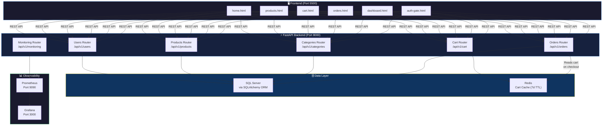
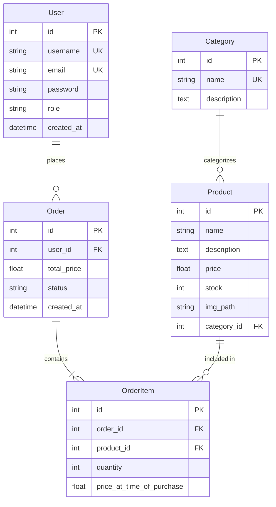

<div align="center">

# 🛒 HNU Store — E-Commerce Fullstack Application

### A Production-Ready Online Store Built with FastAPI, SQL Server & Redis

<br/>

[](https://fastapi.tiangolo.com/)
[](https://www.python.org/)
[](https://www.microsoft.com/sql-server)
[](https://redis.io/)
[](https://www.docker.com/)
[](#license)

<br/>


</div>

<br/>

> **TL;DR** — A fullstack e-commerce platform featuring a **FastAPI** REST backend with **JWT authentication**, **role-based access control** (admin/user), a **Redis-cached shopping cart**, **order lifecycle management**, and a responsive **vanilla HTML/CSS/JS storefront** — all containerized with **Docker Compose** and instrumented with **Prometheus + Grafana** for real-time monitoring.

---

## 📑 Table of Contents

- [Overview](#-overview)
- [Architecture](#-architecture)
- [Repository Structure](#-repository-structure)
- [Features](#-features)
- [API Reference](#-api-reference)
- [Database Schema](#-database-schema)
- [Getting Started](#-getting-started)
- [Docker Deployment](#-docker-deployment)
- [Testing](#-testing)
- [Monitoring](#-monitoring)
- [Technologies](#-technologies)
- [Team](#-team)
- [License](#-license)

---

## 🔎 Overview

HNU Store is a fullstack e-commerce application designed and developed as a collaborative university project. It covers the complete online shopping lifecycle — from user registration and product browsing through cart management, order placement, and admin operations.

### What does it do?

| Layer | Technology | Purpose |
|:-----:|------------|---------|
| 🖥️ **Frontend** | HTML · CSS · JavaScript | Responsive storefront with product catalog, cart, orders, search, and admin dashboard |
| ⚡ **Backend** | FastAPI · SQLAlchemy | RESTful API with 30+ endpoints, JWT auth, and RBAC |
| 🗄️ **Database** | Microsoft SQL Server | Persistent storage for users, products, categories, orders, and order items |
| ⚡ **Cache** | Redis | High-performance shopping cart with 7-day TTL |
| 📊 **Monitoring** | Prometheus · Grafana | Real-time API metrics, error rates, and response time tracking |
| 🐳 **DevOps** | Docker Compose | One-command deployment of all services |

---

## 🏗 Architecture



---

## 📁 Repository Structure

```
ecommerce-fullstack-app/
│
├── 🖥️ frontend/                          # Client-side application
│   ├── home.html                         # Landing page with hero carousel & featured products
│   ├── products.html                     # Product catalog with category filtering
│   ├── search.html                       # Live product search page
│   ├── cart.html                         # Shopping cart management
│   ├── orders.html                       # Order history & tracking
│   ├── profile.html                      # User profile management
│   ├── dashboard.html                    # Admin dashboard (CRUD operations)
│   ├── monitoring.html                   # System health & API metrics
│   ├── auth-gate.html                    # Login / Registration gate
│   ├── index.html                        # Entry point redirect
│   ├── dev-server.py                     # FastAPI dev server with backend proxy
│   └── assets/                           # Static assets
│       ├── css/                          # Stylesheets (vendor + custom shop.css)
│       ├── js/                           # JavaScript (shop-api.js, config, vendor)
│       ├── images/                       # Logos, product images, banners
│       ├── fonts/                        # Custom typography
│       └── vendor/                       # Third-party libraries
│
├── ⚡ main_app/                           # FastAPI backend application
│   ├── main.py                           # Application entry point & middleware
│   ├── database.py                       # SQLAlchemy engine & session (MSSQL + pyodbc)
│   ├── models.py                         # ORM models (User, Product, Category, Order, OrderItem)
│   ├── dependencies.py                   # Auth guards (get_current_user, get_admin_user)
│   ├── db.py                             # Database utilities
│   │
│   ├── routers/                          # API route handlers
│   │   ├── users.py                      # Auth & user management endpoints
│   │   ├── products.py                   # Product CRUD, search, stock management
│   │   ├── categories.py                 # Category CRUD endpoints
│   │   ├── shopping_cart.py              # Redis-backed cart operations
│   │   ├── orders.py                     # Order creation, tracking, cancellation
│   │   └── monitoring.py                 # Health checks & API metrics
│   │
│   ├── crud/                             # Business logic layer
│   │   ├── users.py                      # JWT auth, password hashing, user CRUD
│   │   ├── products.py                   # Product queries with filtering & pagination
│   │   ├── categories.py                 # Category management logic
│   │   ├── shopping_cart.py              # Redis cart operations (add, update, remove, clear)
│   │   └── orders.py                     # Order lifecycle management
│   │
│   ├── schemas/                          # Pydantic request/response models
│   │   ├── users.py                      # UserCreate, UserOut, Token, UserUpdate
│   │   ├── products.py                   # ProductCreate, ProductResponse, ProductUpdate
│   │   ├── categories.py                 # CategoryCreate, CategoryResponse
│   │   ├── shopping_cart.py              # CartItem, CartItemAdd, CartResponse
│   │   └── orders.py                     # OrderResponse, OrderItem schemas
│   │
│   ├── core/                             # Core utilities
│   │   ├── logging_config.py             # Rotating file logger configuration
│   │   └── metrics.py                    # Request/error/response-time counters
│   │
│   ├── tests/                            # Test suites
│   │   ├── conftest.py                   # Shared fixtures & test database setup
│   │   ├── test_auth.py                  # Authentication & authorization tests
│   │   ├── test_cart.py                  # Shopping cart operation tests
│   │   ├── test_orders.py                # Order lifecycle tests
│   │   └── test_products.py              # Product CRUD tests
│   │
│   ├── seed_data.json                    # 90+ products across 5 categories
│   ├── seed_db.py                        # Database seeding script
│   ├── requirements.txt                  # Python dependencies
│   ├── Dockerfile                        # Container image definition
│   ├── docker-compose.yml                # Multi-service orchestration
│   └── prometheus.yml                    # Prometheus scraping configuration
│
├── start.bat                             # Windows one-click launcher
├── .gitignore                            # Git ignore rules
└── README.md                             # ← You are here
```

---

## ✨ Features

### 🔐 Authentication & Security

- **JWT-based authentication** with configurable token expiration
- **Role-based access control** — `user` and `admin` roles
- **Password hashing** with bcrypt (passlib)
- **OAuth2** password flow with Bearer tokens
- Protected admin routes with middleware guards

### 🛍️ Product Management

- Full **CRUD operations** for products (admin-only create/update/delete)
- **Paginated** product listings with configurable page sizes
- **Category-based filtering** and **stock visibility** toggle
- **Product search** by name with live results
- **Stock management** with admin stock dashboard

### 🛒 Shopping Cart (Redis)

- **High-performance** Redis-cached cart (7-day TTL)
- Add, update quantity, remove items, or clear entire cart
- **Real-time stock validation** before adding to cart
- Automatic **subtotal and total** price calculations
- Cart persists across sessions via user-scoped Redis keys

### 📦 Order Management

- **Cart-to-order conversion** with automatic stock deduction
- Order status lifecycle: `pending` → `shipped` → `canceled`
- Users can view **their own orders** or cancel pending orders
- Admins can view **all orders**, ship orders, or cancel any order
- Full order item details with price-at-time-of-purchase snapshots

### 📊 Admin Dashboard

- **Real-time monitoring** page with API metrics
- Request count, error rates, and average response times
- Recent error log viewer
- Product stock management interface
- User management panel

### 🖥️ Storefront Frontend

- **Responsive** HTML/CSS/JS storefront (no framework)
- Hero carousel, featured products, and promo banners
- Live product search with instant results
- Shopping cart with quantity controls
- Order history with status badges
- Dark/light mode toggle
- Clean URL routing (no `.html` extensions)

---

## 📡 API Reference

All endpoints are prefixed with `/api/v1`. Full interactive docs available at `/docs` (Swagger UI) and `/redoc`.

### Authentication & Users — `/api/v1/users`

| Method | Endpoint | Auth | Description |
|:------:|----------|:----:|-------------|
| `POST` | `/register` | — | Register a new user |
| `POST` | `/login` | — | Login and receive JWT token |
| `GET` | `/` | 🔑 Admin | List all users |
| `GET` | `/me` | 🔑 User | Get current user profile |
| `GET` | `/me/role` | 🔑 User | Get current user role |
| `GET` | `/{user_id}` | 🔑 Admin | Get user by ID |
| `PUT` | `/edit` | 🔑 User | Update own profile |
| `DELETE` | `/{user_id}` | 🔑 Admin | Delete a user |

### Products — `/api/v1/products`

| Method | Endpoint | Auth | Description |
|:------:|----------|:----:|-------------|
| `POST` | `/` | 🔑 Admin | Create a new product |
| `GET` | `/` | — | List products (paginated, stock filter) |
| `GET` | `/search` | — | Search products by name |
| `GET` | `/admin/stock` | 🔑 Admin | View product stock levels |
| `GET` | `/{product_id}` | — | Get product details |
| `GET` | `/by-category/{category_id}` | — | Filter by category |
| `PUT` | `/{product_id}` | 🔑 Admin | Update a product |
| `DELETE` | `/{product_id}` | 🔑 Admin | Delete a product |

### Categories — `/api/v1/categories`

| Method | Endpoint | Auth | Description |
|:------:|----------|:----:|-------------|
| `POST` | `/add` | 🔑 Admin | Create a category |
| `GET` | `/getall` | — | List all categories |
| `GET` | `/{category_id}` | — | Get category with products |
| `PUT` | `/{category_id}` | 🔑 Admin | Update a category |
| `DELETE` | `/{category_id}` | 🔑 Admin | Delete a category |

### Shopping Cart — `/api/v1/cart`

| Method | Endpoint | Auth | Description |
|:------:|----------|:----:|-------------|
| `GET` | `/` | 🔑 User | Get current cart |
| `POST` | `/` | 🔑 User | Add item to cart |
| `PUT` | `/{product_id}` | 🔑 User | Update item quantity |
| `DELETE` | `/{product_id}` | 🔑 User | Remove item from cart |
| `DELETE` | `/clear` | 🔑 User | Clear entire cart |

### Orders — `/api/v1/orders`

| Method | Endpoint | Auth | Description |
|:------:|----------|:----:|-------------|
| `POST` | `/create` | 🔑 User | Create order from cart |
| `GET` | `/get/my_orders` | 🔑 User | Get own orders |
| `GET` | `/get/user/{user_id}` | 🔑 Admin | Get orders by user |
| `GET` | `/get_all_orders` | 🔑 Admin | List all orders |
| `DELETE` | `/cancel/{order_id}` | 🔑 User | Cancel a pending order |
| `PUT` | `/put/ship/{order_id}` | 🔑 Admin | Mark order as shipped |

### Monitoring — `/api/v1/monitoring`

| Method | Endpoint | Auth | Description |
|:------:|----------|:----:|-------------|
| `GET` | `/dashboard` | — | API health and metrics |
| `GET` | `/health` | — | Service health check |

---

## 🗄️ Database Schema



---

## 🚀 Getting Started

### Prerequisites

| Requirement | Details |
|-------------|---------|
| **Python** | 3.10 or higher (developed with 3.11) |
| **SQL Server** | Any edition with ODBC Driver 17+ installed |
| **Redis** | 7.x (local install or Docker) |
| **pip** | Latest version recommended |

### 1. Clone the Repository

```bash
git clone https://github.com/aliabdou92019/ecommerce-fullstack-app.git
cd ecommerce-fullstack-app
```

### 2. Configure Environment Variables

Create a `.env` file inside the `main_app/` directory:

```env
DB_SERVER=localhost
DB_NAME=ecommerce_db
DB_DRIVER=ODBC Driver 17 for SQL Server
DB_USER=sa
DB_PASSWORD=your_password

SECRET_KEY=your-super-secret-jwt-key
ACCESS_TOKEN_EXPIRE_MINUTES=60
```

### 3. Create a Virtual Environment

```bash
python -m venv venv

# Activate:
source venv/bin/activate        # macOS / Linux
venv\Scripts\activate           # Windows
```

### 4. Install Dependencies

```bash
pip install -r main_app/requirements.txt
```

### 5. Seed the Database

```bash
cd main_app
python seed_db.py
```

This seeds the database with:
- ✅ An admin user (`admin@gmail.com` / `admin123`)
- ✅ 5 product categories (Electronics, Home Appliances, Accessories, Gaming, Smart Home)
- ✅ 90+ products across all categories

### 6. Start the Backend

```bash
cd main_app
uvicorn main:app --host 127.0.0.1 --port 8000
```

### 7. Start the Frontend Dev Server

```bash
python frontend/dev-server.py --port 5500 --backend http://127.0.0.1:8000
```

### 8. Open the Store

Navigate to **http://127.0.0.1:5500/home** in your browser.

> 💡 **Windows Shortcut:** Run `start.bat` from the project root to launch both servers and open the browser automatically.

---

## 🐳 Docker Deployment

Deploy the entire stack with a single command:

```bash
cd main_app
docker-compose up --build
```

This starts **4 services**:

| Service | Container | Port | Description |
|---------|-----------|:----:|-------------|
| **App** | `ecommerce_app` | `8000` | FastAPI backend + frontend static files |
| **Redis** | `ecommerce_redis` | `6379` | Shopping cart cache |
| **Prometheus** | `prometheus` | `9090` | Metrics collection |
| **Grafana** | `grafana` | `3000` | Metrics visualization |

---

## 🧪 Testing

The project includes 4 test suites covering authentication, cart operations, orders, and product management.

```bash
cd main_app
pytest tests/ -v
```

| Test Suite | Coverage |
|------------|----------|
| `test_auth.py` | User registration, login, token validation, role-based access |
| `test_cart.py` | Cart add/update/remove/clear, stock validation |
| `test_orders.py` | Order creation, cancellation, shipping, user/admin access |
| `test_products.py` | Product CRUD, search, pagination, category filtering |

---

## 📊 Monitoring

### Built-in Metrics

The backend tracks key metrics via middleware:

- **Total Requests** — Cumulative count of all API calls
- **Error Rate** — Percentage of 5xx responses
- **Average Response Time** — Mean request duration in seconds
- **Recent Errors** — Last 50 error-level log entries

Access the monitoring dashboard at `/api/v1/monitoring/dashboard` or view the frontend monitoring page.

### Prometheus + Grafana

With Docker Compose running:

- **Prometheus** → http://localhost:9090
- **Grafana** → http://localhost:3000

The `prometheus-fastapi-instrumentator` library automatically exposes detailed HTTP metrics at `/metrics`.

---

## 🛠 Technologies

| Category | Tools |
|----------|-------|
| **Language** | Python 3.11 |
| **Web Framework** | FastAPI · Uvicorn |
| **ORM** | SQLAlchemy |
| **Database** | Microsoft SQL Server (via pyodbc) |
| **Cache** | Redis (async, 7-day TTL) |
| **Authentication** | python-jose (JWT) · passlib (bcrypt) · OAuth2 |
| **Validation** | Pydantic · email-validator |
| **Testing** | pytest · httpx |
| **Monitoring** | Prometheus · Grafana · prometheus-fastapi-instrumentator |
| **Containerization** | Docker · Docker Compose |
| **Frontend** | HTML5 · CSS3 · JavaScript · Bootstrap |
| **Logging** | Python logging (RotatingFileHandler) |

<details>
<summary><b>📋 Full <code>requirements.txt</code></b></summary>

```
fastapi
uvicorn
sqlalchemy
pyodbc
python-dotenv
pydantic
pydantic-settings
passlib[bcrypt]==1.7.4
bcrypt==3.2.2
python-jose[cryptography]
email-validator
redis[asyncio]>=5.0.0
python-multipart
prometheus-fastapi-instrumentator
httpx
```

</details>

---

## 🤝 Contributing

Contributions, bug reports, and feature requests are welcome!

1. **Fork** the repository
2. **Create** a feature branch — `git checkout -b feature/your-feature`
3. **Commit** your changes — `git commit -m "Add your feature"`
4. **Push** to the branch — `git push origin feature/your-feature`
5. **Open** a Pull Request

---

## 👥 Team

This project was built collaboratively by our engineering team:

| Member | Responsibility |
|--------|----------------|
| **Amira Azzam** | Security layer — users, JWT authentication, and authorization |
| **Ali Abdo** | Products — CRUD operations, stock management, and filtering |
| **Youssef Waheed** | Architecture — database design, ORM models, and project consulting |
| **Maria Gerges** | Shopping cart — cart logic and Redis caching implementation |
| **Yousef Medhat** | Orders — order processing system and order item management |
| **Amr Yasser** | Categories and frontend — category endpoints and full UI development |

---

## 📄 License

This project was developed for **academic and educational purposes** as part of a university course at Helwan National University.

---

<div align="center">
<br/>

**Built with ❤️ using FastAPI · SQL Server · Redis · Docker**

<br/>

<sub>⭐ Star this repo if you found it useful!</sub>

</div>
